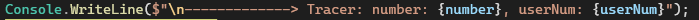
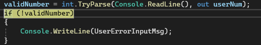
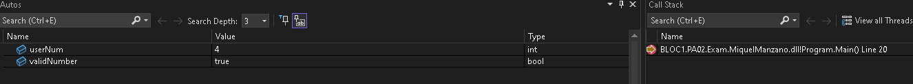
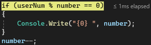
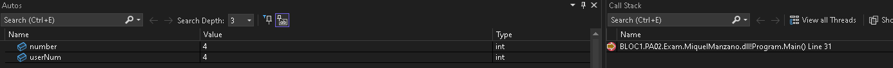
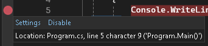

# BLOC1.PA02.Exam.MiquelManzano

Podras trobar els exercicis en diferents branches.
- ExerciseTwo
- ExerciseThree
- ExerciseFour

Aqui abaix te deixat el ultim exercici 5:

## Exercise 5
TRACER:

BREAKPOINT USERINTPUT:

BREAKPOINT IF CONDITION

Para hacer un breakpoint en una linea has de poner la bolita roja en la parte izquierda del IDE en la linea que quieres debugar

